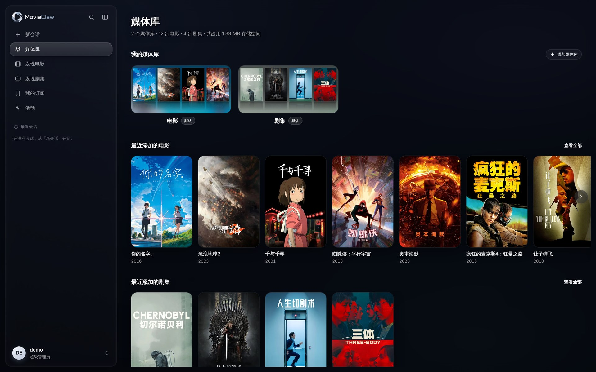
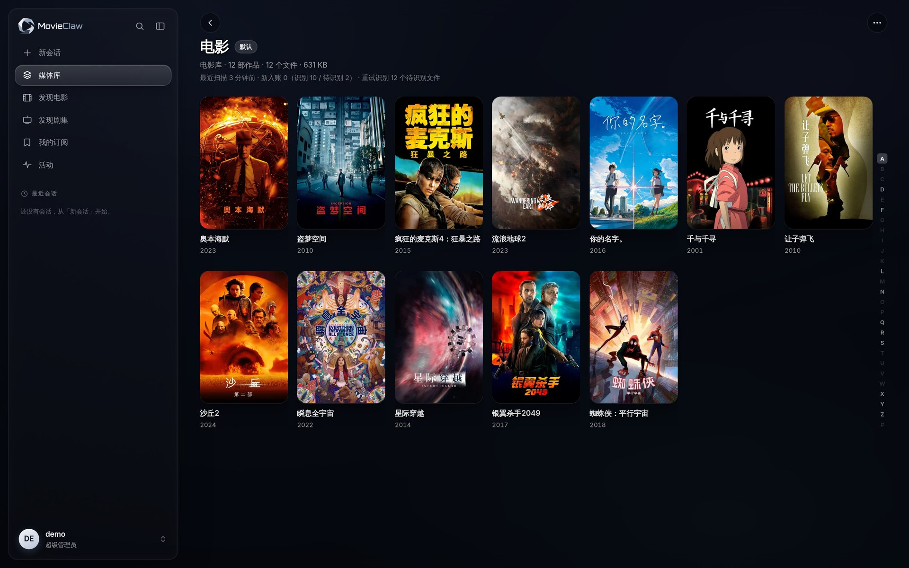
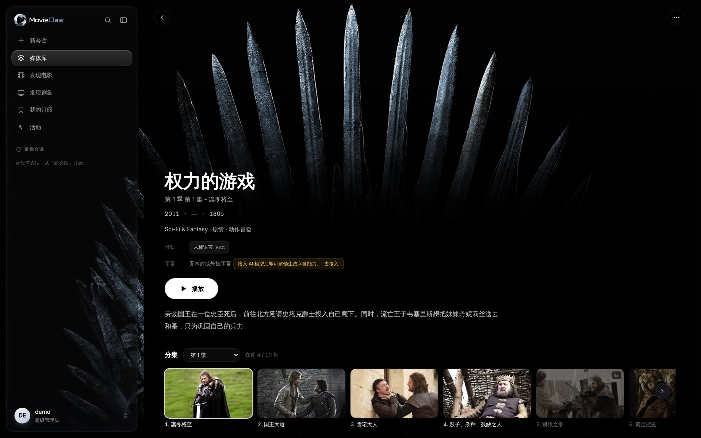
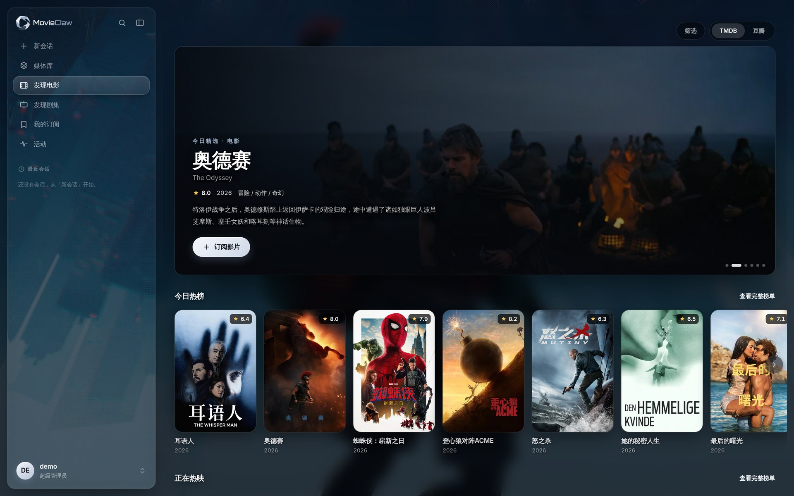
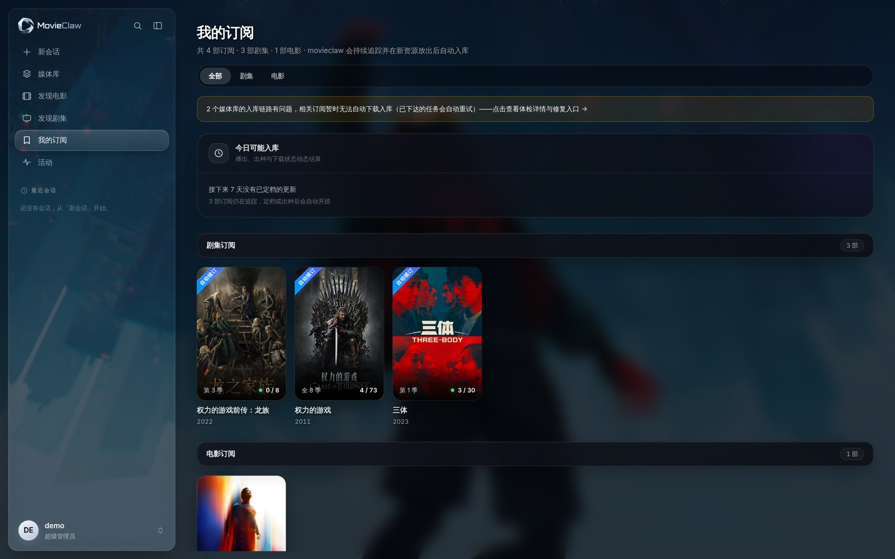

<p align="center">
  <picture>
    <source media="(prefers-color-scheme: dark)" srcset="docs/images/logo-dark.png">
    
  </picture>
</p>

<h3 align="center">指向你存片的目录，剩下的交给它</h3>

<p align="center">
  自托管的影视库管理程序。刮削、追剧订阅、播放、AI 助手，装一个就够。<br>
  不用再拼 Jellyfin + Sonarr + Radarr + Prowlarr + Bazarr + Overseerr 六件套。<br>
  数据全在你自己的机器上。
</p>

<p align="center">
  <a href="#5-分钟跑起来">快速开始</a> ·
  <a href="#它长什么样">截图</a> ·
  <a href="#它能替你做什么">功能</a> ·
  <a href="#boundaries">边界</a> ·
  <a href="docs/design/">设计文档</a> ·
  <a href="https://github.com/yipengfei329/movieclaw/issues">反馈</a>
</p>

<p align="center">
  <a href="https://github.com/yipengfei329/movieclaw/releases"></a>
  <a href="https://hub.docker.com/r/movieclaw/movieclaw"></a>
  <a href="https://hub.docker.com/r/movieclaw/movieclaw/tags"></a>
  
  <a href="LICENSE"></a>
</p>

<p align="center">
  
</p>

## 它解决什么问题

在家里把影视这件事跑通，通常是这么一套：Jellyfin 放着看，Sonarr 和 Radarr 管订阅，
Prowlarr 接站点，Bazarr 抓字幕，Overseerr 给家人点播。**六个容器，六份配置，六次升级**，
还要自己保证它们对同一个媒体库的理解不打架。

MovieClaw 把这条链路做进一个进程：

| 你想做的事 | 常见做法 | MovieClaw |
| --- | --- | --- |
| 看片、海报墙、进度同步 | Jellyfin / Emby / Plex | 内置 |
| 元数据刮削 | 上面自带，认不准再上 tinyMediaManager | 内置，TMDB 与豆瓣双源 |
| 订阅追剧、自动下载 | Sonarr + Radarr | 内置 |
| 站点、索引器接入 | Prowlarr / Jackett | 内置 23 个 PT 站点配置 |
| 字幕 | Bazarr | 内置，含 PGS 图形字幕转 SRT |
| 家人点播与权限 | Overseerr / Jellyseerr | 内置成员管理 |
| 在微信里一句话操作这一切 | 没有现成的 | 内置 AI 助手 |
| **加起来** | **6 个容器 / 6 份配置** | **1 个容器 / 1 个 `data` 目录** |

一体化不是白拿的。它的代价和边界写在[「它不做什么、不锁你什么」](#boundaries)，
那一节请一定读完再决定。

## 它长什么样

下面四张按你实际会走的顺序排：进来、逛库、看详情、订阅追更。
截图取自真实运行的实例，元数据是 TMDB 真刮的。

<table>
  <tr>
    <td width="50%"></td>
    <td width="50%"></td>
  </tr>
  <tr>
    <td><b>媒体库</b>：中文片名、海报、年份，右侧字母索引快速跳转</td>
    <td><b>剧集详情</b>：分集剧照、音轨与字幕清单，缺的集数直接标灰</td>
  </tr>
  <tr>
    <td></td>
    <td></td>
  </tr>
  <tr>
    <td><b>发现</b>：TMDB 与豆瓣榜单随时切换，看到就能订</td>
    <td><b>订阅</b>：每部剧的到货进度，以及未来七天可能入库什么</td>
  </tr>
</table>

## 它能替你做什么

### 给看片的人

- **打开就是海报墙。** 简介、评分、演职员、分集剧照都存在本地，断网也能翻。
- **想看什么，点一下「订阅」。** 有合适的资源出现就自动下载、改名、入库。
  你不用学规则语法，也不用打开下载器。
- **Infuse 里填个地址就能连。** MovieClaw 对外是一台 Jellyfin 服务器，
  Infuse、Fileball、VidHub、SenPlayer 直接播，看到哪一集也会同步回来。播放器那边不用改设置。
- **浏览器里也能直接播。** 音轨、字幕、续播位置都在。能直连就直连，
  只有浏览器放不了的编码才转码，转之前先告诉你代价。
- **这台机器没有硬解？把转码交给一台 Mac。** 远程转码 Worker 是个 macOS 菜单栏 App
  （Apple Silicon，走 VideoToolbox 硬件编码），一台常年开着的 Mac mini 正合适。
  NAS 那边仍然只管鉴权、播放决策和取流，编码活儿派出去。
- **家人一人一个账号。** 能看哪些库、能不能订阅、能不能直接下载，逐项开关。
  播放进度、已看标记、收藏各存各的，互不干扰。

### 给管家的人

- **不要求你重命名任何一个文件。** 指向已有目录就能用。想让它帮你整理是另一个开关，
  默认不动你的盘。
- **认不准就不猜。** 识别不了的文件进「待识别」，界面上直接写清楚为什么，
  比如「有 3 个同样可信的候选，机器不敢替你选」。一次认领整组生效，一部剧几十集只点一次。
- **洗版。** 把目标画质写成规则组，出现更好的版本自动换。旧文件进「待回收」延迟删除，
  正在做种的副本不会被抢走。想 1080p REMUX 和 4K 两个版本都留着？
  规则组里打开「保留旧版本共存」。
- **种子名不是靠正则硬猜的。** 分辨率、片源、编码、字幕、音轨、制作组各占一个字段，
  订阅规则才匹配得准：

  ```text
  三体.Three-Body.2023.S01E05.2160p.WEB-DL.H265.AAC.国语中字-OurTV
  ↓
  剧集 · 第 1 季第 5 集 · 2160p · H.265 · WEB-DL · AAC
  字幕：中文    音轨：普通话    制作组：OurTV
  ```

  「国语中字」这种只有中文站才有的写法，也能拆成字幕和音轨两个字段。这一步用的是随镜像
  内置的小模型，不是一堆打地鼠式正则。

- **刮削口味可以调。** 元数据语言优先级、海报是按语言挑还是用 TMDB 默认、海报和背景图的
  最低宽度、命名模板（`{title} ({year}) - S{season:02d}E{episode:02d}` 这种）、
  NFO 和分集剧照要不要写进媒体目录，都在「设置 → 刮削与整理」里。
  自动挑的图不合口味，详情页可以手动换一张并锁住，之后刷新元数据不会被覆盖。
- **新站先养着。** 打开站点保护后，订阅链路绕开这个站，你手动搜索不受影响。
  配合自动刷流把分享率养起来再放开。
- **更新和回退都在网页上点。** 日常升级只下载几 MB 的产物包，不用重拉镜像。
  更新坏了容器会自己回落到上一个能用的版本，数据不动。
- **出错说人话。** 日志和界面提示都是中文，写给「部署了但不写代码」的人看。

### AI 助手能做的事

需要你自己接入一个大模型（「设置 → AI 模型」，OpenAI 兼容端点都行）。
不接也不影响其余功能。

- **在微信里说一句就行。** 「三体第二季出了就订」「把最近入库的剧刷新一下元数据」。
  微信还能直接发语音，取的是微信自己转写出的文字。Telegram 和 Discord 同样能对话，
  目前只收文字。人不在电脑前，躺着也能安排。
- **它是真在操作产品，不是猜接口。** 助手调的是 MovieClaw 自己的命令行，
  而这套命令行由 OpenAPI 规格生成：后端加一个接口，助手就自动多一项能力，
  不用有人去补一遍工具定义。长会话会自动压缩上下文，不会聊着聊着崩掉。
- **缺字幕就自己做一份。** 找不到目标语言的字幕时，自动找源、翻译、落盘成外挂 SRT，
  时间轴按音轨校准。

它的权限边界写在下一节。那一节比这份能力清单更重要。

<a id="boundaries"></a>

## 它不做什么、不锁你什么

### 不做什么

- **不替代下载器。** 下载仍然交给你自己的 qBittorrent 或 Transmission。
- **不替代硬件。** 没有可用的硬件编解码，MovieClaw 变不出来。软件转码很吃 CPU，
  开之前界面会先把代价告诉你。
- **不做云端中转。** 远程访问用你自己的方案（Tailscale、WireGuard、反向代理），
  MovieClaw 不经手你的流量。
- **不提供任何影视资源。** 站点账号是你自己的。站点配置只是让你已有的账号用起来省事。

### 不锁你什么

- **不改你的文件名和目录结构**，除非你主动让它整理。你随时可以让 Jellyfin 或 Emby
  直接接管同一批文件。
- **运行数据只有一个目录。** `data/` 里放着 SQLite、日志、图片缓存与资产、上传文件和模型。
  备份它就够了，删容器不动数据。
- **不采集、不回连、不需要注册任何云端账号。** 你的观看记录不会离开这台机器。

### AI 助手的权限边界

把媒体库、文件整理和一个能执行命令的助手放进同一个产品，风险是真的。
社区里已经有人被自动整理「删了个精光，一个源文件都没剩」。
所以这里的约束写在代码里，不是提示词里的君子协定：

- **凭证不进 bash。** 助手操作产品只能走专用工具，`bash` 子进程的环境变量里看不到任何令牌。
- **危险操作必须显式确认。** 其中「删除媒体文件」还要先用只读命令查清将删除的具体条目、
  向你复述、拿到本轮明确同意才能动手。**你泛泛说一句「清理一下」，不算同意。**
- **删除走延迟回收**，不是立刻 `rm`。正在做种的副本不动。
- **每一步工具调用在会话里可见可回溯**，出了问题能查是哪一步。

## 5 分钟跑起来

前提只有一个：机器上装好 Docker（群晖用自带的 Container Manager，其他 NAS 用各自的 Docker 套件）。
官方镜像 [`movieclaw/movieclaw`](https://hub.docker.com/r/movieclaw/movieclaw) 单容器跑全部：
不用另装数据库、不用配 Redis，连 TMDB Key 都已内置（不必自己去申请）。
同一个标签同时支持 x86_64 与 ARM64。

**第 1 步**：新建一个文件夹，在里面创建 `docker-compose.yml`，粘贴：

```yaml
services:
  movieclaw:
    image: movieclaw/movieclaw:latest
    container_name: movieclaw
    init: true
    ports:
      # 左边是宿主端口，被占了就改左边（比如 "8096:3000"），右边保持 3000
      - "3000:3000"
    volumes:
      - ./data:/app/data              # 运行数据，备份这个文件夹就够了
                                      # （含隐藏文件 .secret_key，备份工具别跳过点文件）
      - /volume1/media:/media         # ← 改成你的媒体目录
      - /volume1/downloads:/downloads # ← 改成下载器的保存目录
      # 多个媒体盘 / 多个下载目录？每个加一行即可，数量不限：
      # - /volume2/movies:/movies
    environment:
      - TZ=Asia/Shanghai
    # 想用核显 / 独显做硬件转码？先在宿主上 `ls /dev/dri` 确认它存在（ARM 机型、
    # 纯 CPU 主机通常没有）。不存在却打开下面两行，容器会被重建然后起不来，
    # 只留一句英文 no such file or directory。不确定就先别动：装好后首启日志
    # 会直接告诉你能不能硬解、缺什么。
    # devices:
    #   - /dev/dri:/dev/dri
    restart: unless-stopped
```

**第 2 步**：把 `volumes` 里的路径改成你机器上的真实路径。规则只有一条：
冒号**左边**是你机器上的目录，**右边**是 MovieClaw 在容器里看到的路径；
之后在网页里填路径时，填的都是右边那个。下载器的保存目录一定要挂进来，
否则 MovieClaw 看不到下载完成的文件，也就没法整理入库。

> **冒号左边必须是机器上已经存在的目录。** 路径写错了 Docker 不会报错，
> 它会默默替你新建一个空文件夹，容器照常启动、日志干干净净，然后你的媒体库一片空白。
> 群晖用户尤其注意盘符和大小写（`/volume1` 还是 `/volume2`、`media` 还是 `Media`）。
> 粘贴前先 `ls` 一下要挂的目录，或在文件管理器里核对一遍。

**第 3 步**：在这个文件夹下启动（NAS 图形界面用户：Container Manager →「项目 → 新增」，指向这个文件夹）：

```bash
docker compose up -d
```

首次启动快的机器十来秒，慢一些的 NAS 可能要一两分钟。这期间打开页面只会看到「正在连接服务…」，
属正常；`docker logs movieclaw` 里出现「前端反代 已就绪」就是真的起来了。
如果这一步直接报 `failed to bind host port 0.0.0.0:3000/tcp: address already in use`，
是 3000 端口被占了，见下面[常见问题](#常见问题)的第二条。

**第 4 步**：浏览器打开 `http://<主机IP>:3000`，按引导创建管理员账号，然后：

1. **建媒体库**：「媒体库 → 添加媒体库」，根路径填**容器内路径**，也就是第 2 步冒号右边那个：
   按上面的例子是 `/media`，**不是** `/volume1/media`。建好即开始扫描，存量文件会被识别刮削，
   认不准的进「待识别」等你确认。
   填错了页面同样会提示「正在扫描」，但扫完是 0 个文件，扫描结果里写着「根路径不存在，已跳过」。
   看到这句就是路径填错了。
2. **接下载器**：「设置 → 下载器」接入 qBittorrent / Transmission；下载器与 MovieClaw 看到的路径不一致时，在这里配好路径映射。
3. **接站点**：「设置 → 资源站点」填 Cookie / API Key，或装浏览器扩展自动同步。
4. 可选：「设置 → AI 模型」接入大模型解锁 AI 助手；「设置 → 监听导入」加一条「源目录 → 目标库」规则，让任意来源的下载也自动入库。

> 只想试一条命令？
> `docker run -d --name movieclaw --init -p 3000:3000 --restart unless-stopped -e TZ=Asia/Shanghai -v "$(pwd)/data:/app/data" -v /volume1/media:/media -v /volume1/downloads:/downloads movieclaw/movieclaw:latest`
> 挂载路径的规则和上面完全一样。

### 日常升级：不用重拉镜像

装完之后的日常升级在「设置 → 应用 → 版本与更新」里一键完成：下载的是 GitHub Release 上
几 MB 的产物包（可配加速镜像），更新落在 `data` 卷上，容器重建也不丢。更新出问题可在同一页面
一键回退，坏更新还会被容器自动回落到可用版本。

只有当更新说明里明确写着「包含依赖变化，需升级 Docker 镜像」时，才需要
`docker compose pull && docker compose up -d`。这种情况很少发生。
（机制见 [in-app-update.md](docs/design/in-app-update.md)）

## 用别的播放器看

MovieClaw 对外提供 Jellyfin 兼容的播放接口，第三方播放器**把它当成一台 Jellyfin 服务器**填地址就能连。
下表标注每种客户端的支持形态，标「真机验证」的是在实际设备上连过、播过的：

| 客户端 | 状态 | 说明 |
| --- | --- | --- |
| 网页播放器 | 内置 | 直连优先，浏览器放不了的编码才转码，转码前会告诉你代价 |
| Infuse / VidHub | **真机验证可用** | 以 Jellyfin 服务器身份连接，浏览、直连播放、进度同步，播放器侧零改动 |
| Fileball / SenPlayer | 同一套接口 | 走的是同一条 Jellyfin 兼容链路，但没有逐台真机验证过 |
| Emby / Jellyfin 官方 App | 不适用 | 它们连的是自己的服务端；MovieClaw 可以在入库后通知 Emby/Jellyfin 刷新 |
| 局域网自动发现 | 部分 | 桥接网络下广播到不了容器，需 host 网络或手动填地址 |
| 远程硬件转码 | macOS Apple Silicon | 菜单栏 App，走 VideoToolbox 硬件编码（一台常开的 Mac mini 就够）。协议开放，其他平台可自行扩展 |

细节见 [jellyfin-compat.md](docs/design/jellyfin-compat.md)、[web-player.md](docs/design/web-player.md)、
[remote-transcode.md](docs/design/remote-transcode.md)。

## 常见问题

<details>
<summary><b>忘记管理员密码了怎么办</b></summary>

在跑着 MovieClaw 的机器上执行一条命令即可重置，**不动任何配置与数据**：站点、下载器、
媒体库、订阅全部原样保留，只换密码：

```bash
# Docker 部署（容器名按你 compose 里的实际值改）
docker exec -it movieclaw python -m movieclaw_api.reset_password

# 源码部署：先 cd 到项目根目录（data/ 的上一级）
python -m movieclaw_api.reset_password
```

按提示输入两次新密码即可，不必重启服务。连用户名也忘了就加 `--show` 先看一眼。
想让别处已登录的设备一并下线，再 `docker restart movieclaw`。

为什么不做网页版「忘记密码」：自托管没有可信第三方能证明「你是账号主人」，真做邮件找回
就得要求每位部署者先配 SMTP。这里把身份证明换成更硬的一件事：**能访问这台机器的
`data/` 目录，就是主人**。Jellyfin、Vaultwarden、Gitea 同理。

家人朋友的**成员**账号忘了密码不用这条命令：管理员在「设置 → 成员」里点一下重置就行。
</details>

<details>
<summary><b>3000 端口被别的服务占了</b></summary>

改 `ports` 冒号**左边**即可，比如 `"8096:3000"`，之后用 `http://<主机IP>:8096` 访问，
容器内端口不用动。

只有用 `--network host` 时容器内端口就是宿主端口，这时才需要真正换监听端口：
加 `-e MOVIECLAW_WEB_PORT=8096`，或装好后在「设置 → 应用 → 网络与维护」里改（保存后自动重启生效）。

**但 host 网络还有个坑**：容器内部的前端（3001）和后端（8000）也会直接占用宿主的这两个端口，
它们目前不可改，`MOVIECLAW_WEB_PORT` 管不到。任一个被别的服务占了，容器会启动失败并退出，
`docker logs` 里是一行英文 `EADDRINUSE: address already in use`。另外 host 网络下还会监听
UDP 7359（Jellyfin 局域网自动发现），和已有的 Jellyfin / Emby 会撞。

**所以：除非你确实需要局域网自动发现，否则用上面改冒号左边的办法，别上 host 网络。**
</details>

<details>
<summary><b>刮削一直失败，日志说连不上 TMDB</b></summary>

日志或「设置 → 网络与代理」的连通性测试里出现 `无法连通 TMDB`、`ConnectTimeout`、
`CircuitOpenError`、`CERTIFICATE_VERIFY_FAILED` 这类字样，都属于这一类。

所在网络直连不到 `api.themoviedb.org` 时，到「设置 → 网络与代理」配置代理或镜像地址，
并用页面上的连通性测试验证。默认走代理的服务是 TMDB、图片回源和 GitHub 更新，
PT 站点保持直连（通常直连更快）。
</details>

<details>
<summary><b>容器以什么身份跑？支持 PUID / PGID 吗</b></summary>

**以 root 跑，目前不支持 PUID / PGID。** `data/` 里的数据库、密钥文件属主都是 `root:root`。

挂进来的媒体目录**需要可写**，整理入库、洗版回收都要动文件；只读挂载会让这些功能失败。
如果你的 NAS 上这些目录属于别的用户，root 通常仍可读写，但反过来你用自己的账号
去看 MovieClaw 新建的目录可能会遇到权限问题。介意的话，先在宿主上把目录权限放开再挂。
</details>

<details>
<summary><b>媒体库放在 SMB / NFS 网络挂载上</b></summary>

建库时把「实时文件监控」关掉。网络挂载上的文件事件不可靠，靠定期对账与手动扫描更稳。
</details>

## 从源码构建

需要先在 [themoviedb.org](https://www.themoviedb.org/settings/api) 免费申请一个 TMDB API Key
（官方镜像已内置，自建才需要）。

```bash
git clone https://github.com/yipengfei329/movieclaw.git
cd movieclaw
TMDB_API_KEY=你的key ./scripts/build-image.sh
#   国内网络加速：      CN_MIRROR=1 TMDB_API_KEY=... ./scripts/build-image.sh
#   给 NAS 交叉构建：   PLATFORM=linux/amd64 TMDB_API_KEY=... ./scripts/build-image.sh
```

Key 也可以写进仓库根目录的 `.env`。注意 `.env.example` 里那行 `# TMDB_API_KEY=` 是**注释掉的**，
得先去掉 `#` 再填，否则脚本读不到。没提供 Key 时脚本会立刻报错退出，不会浪费时间开始构建。

构建过程需要能出站访问 `deb.debian.org`、`repo.jellyfin.org`、`pypi.org`、
`registry.npmjs.org` 和 GitHub。国内网络加 `CN_MIRROR=1` 即可；
如果你在会拦截并重签 TLS 的企业代理后面，构建会停在 `curl ... exit code 60`
或 pip 的 `CERTIFICATE_VERIFY_FAILED`。那是证书信任问题，不是脚本的问题。

然后把 `docker-compose.yml` 的 `image` 一行改成 `movieclaw:latest` 再启动。
构建会自动生成 PGS 测试样本并 OCR 回 SRT，失败即阻断。字幕运行时的架构与发布门禁见
[docker-subtitle-runtime.md](docs/design/docker-subtitle-runtime.md)。

## 本地开发

**先确认 3000 和 8000 两个端口是空的。** 如果这台机器上正跑着 MovieClaw 的 Docker 容器，
先 `docker compose down` 停掉。这是最典型的贡献者画像（先用了镜像，再想改代码），
100% 会撞上。端口被占时脚本会直接报错退出并告诉你怎么查占用进程（依赖 `lsof`）。

```bash
./scripts/dev.sh          # 同时启动后端和前端
./scripts/dev.sh api      # 只启动后端
./scripts/dev.sh web      # 只启动前端
```

脚本会自动完成首次环境准备（建虚拟环境、装依赖、生成 `.env`、`pnpm install`），
日志带 `[api]` / `[web]` 彩色前缀，`Ctrl-C` 一键停止全部（子进程一起收走，端口会释放干净）。
它建虚拟环境时挑本机最新的 Python（3.14 → 3.11），可能和你 `python3` 指向的不是同一个。

手动安装要**两个终端**，后端和前端都是前台进程：

```bash
# 终端 1：后端（Python 3.11+）
python3 -m venv .venv && source .venv/bin/activate
pip install -e ".[dev]"
cp .env.example .env
uvicorn movieclaw_api.main:app --factory --reload --reload-dir src
```

> `--reload-dir src` 别省：uvicorn 默认监听整个当前目录，而运行期日志就写在
> `data/logs/` 里，写日志触发重载检测、检测本身又写一行日志，刷屏到日志没法看。
> 用 `./scripts/dev.sh` 起则不用操心，入口里已经钉好了。

```bash
# 终端 2：前端（Node.js 20+）
pnpm install && pnpm web:dev
```

Web 控制台 `http://127.0.0.1:3000`，API 文档 `http://127.0.0.1:8000/docs`。
空 `.env` 不填任何东西也能起来，只是 TMDB 相关功能不可用。

> 要改端口得改两处。后端端口在 `.env` 的 `APP_PORT`，但前端的反代目标默认写死指向
> `http://127.0.0.1:8000`，**必须同时**在 `apps/web/.env.local` 里设
> `MOVIECLAW_API_PROXY_TARGET` 指向新端口。只改一处的话页面能打开，但所有接口都拿不到数据。
> 前端的 3000 是硬编码的，不能配。手动路径下 uvicorn 撞端口只会甩一句
> `[Errno 98] Address already in use`，没有 `dev.sh` 那层中文提示。

源码方式运行时，**种子名结构化抽取依赖的 NER 模型需手动放置**（Docker 镜像已内置）：
从 [Releases](https://github.com/yipengfei329/movieclaw/releases) 下载 `model.int8.onnx`、
`tokenizer.json`、`labels.json` 放进 `data/models/torrent-ner/`（可用 `MOVIECLAW_NER_DIR` 改路径）后重启。
不放模型服务照常启动，仅该功能不可用：首次真正触发种子名抽取时，日志会打印
「未找到种子名抽取模型（…），片名/年份/季集字段将保持空值」。
注意这条提示是**懒加载**的。启动日志里看不到它，别以为没报错就是模型已就位。

## 文档与支持

各模块的重大设计与取舍都记录在 [`docs/design/`](docs/design/)，一事一档：媒体库、元数据、
订阅、洗版、Jellyfin 兼容、应用内更新、CLI……按文件名找感兴趣的主题即可。
本 README 自身的结构依据见 [readme-rewrite.md](docs/design/readme-rewrite.md)。

有问题、有建议、发现 Bug，都欢迎开
[Issue](https://github.com/yipengfei329/movieclaw/issues)。

## License

[MIT](LICENSE)
