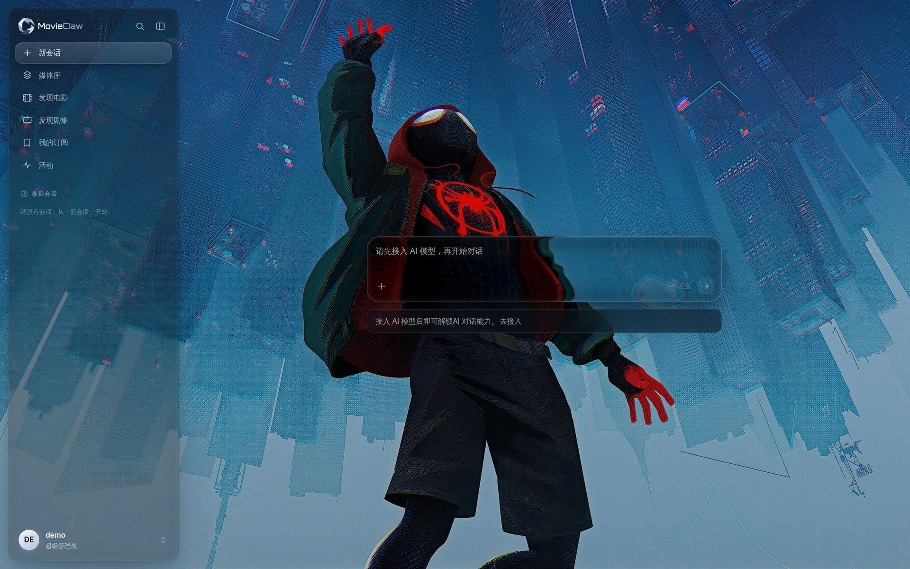
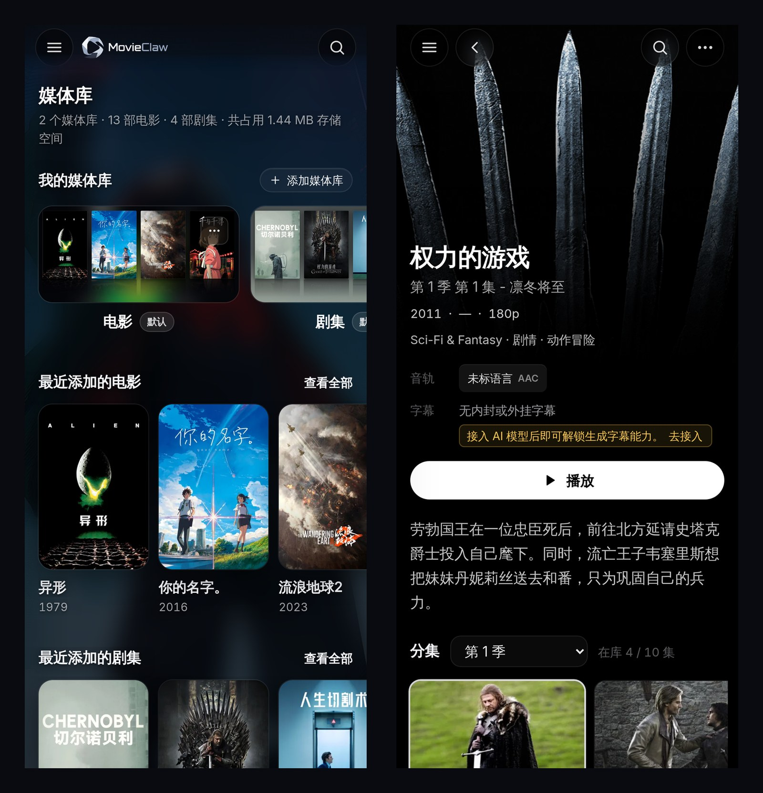

<p align="center">
  <picture>
    <source media="(prefers-color-scheme: dark)" srcset="docs/images/logo-dark.png">
    
  </picture>
</p>

<h3 align="center">全新一代智能影音产品，最佳影视Agent</h3>

<p align="center">
  把存片的目录指给 MovieClaw，海报墙、追剧订阅、多端播放一条线跑通。<br>
  一个容器替代 Jellyfin + Sonarr + Radarr + Prowlarr + Bazarr + Overseerr 六件套。<br>
  数据全在你自己的机器上。
</p>

<p align="center">
  <a href="README.md">English</a> | <b>简体中文</b>
</p>

<p align="center">
  <a href="#5-分钟跑起来">快速开始</a> ·
  <a href="#界面预览">截图</a> ·
  <a href="#能做什么">功能</a> ·
  <a href="#boundaries">边界</a> ·
  <a href="#在别的机器上操控它">命令行</a> ·
  <a href="docs/design/">设计文档</a> ·
  <a href="https://github.com/movieclaw/movieclaw/issues">反馈</a>
</p>

<p align="center">
  <a href="https://github.com/movieclaw/movieclaw/releases"></a>
  <a href="https://hub.docker.com/r/movieclaw/movieclaw"></a>
  <a href="https://hub.docker.com/r/movieclaw/movieclaw/tags"></a>
  
  <a href="LICENSE"></a>
</p>

<p align="center">
  
</p>

## 为什么用它

你想做的事其实只有一件：想看什么，点一下"订阅"，资源一出就自动下好、改好名、放进海报墙，
打开就能播。这一条线，在家里通常要拼六个容器：Jellyfin 放片，Sonarr、Radarr 管订阅，
Prowlarr 接站点，Bazarr 抓字幕，Overseerr 给家人点播，还要保证它们对同一个媒体库的理解一致。

MovieClaw 把这条线收进一个容器：

| 你想做的事 | 常见做法 | MovieClaw |
| --- | --- | --- |
| 看片、海报墙、进度同步 | Jellyfin / Emby / Plex | 内置 |
| 元数据刮削 | 上面自带，认不准再上 tinyMediaManager | 内置，TMDB 与豆瓣双源 |
| 订阅追剧、自动下载 | Sonarr + Radarr | 内置 |
| 站点、索引器接入 | Prowlarr / Jackett | 内置 23 个 PT 站点配置 |
| 字幕 | Bazarr | 内置，含 PGS 图形字幕转 SRT |
| 家人点播与权限 | Overseerr / Jellyseerr | 内置成员管理 |
| 在微信里一句话操作这一切 | 没有现成的 | 内置 AI 助手 |
| 加起来 | 6 个容器 / 6 份配置 | 1 个容器 / 1 个 `data` 目录 |

一体化有代价，边界写在[下一节](#boundaries)。

## 界面预览

下面四张按实际使用顺序排：进来、逛库、看详情、订阅追更。截图取自真实运行的实例，
元数据由 TMDB 真实刮削。

<table>
  <tr>
    <td width="50%"></td>
    <td width="50%"></td>
  </tr>
  <tr>
    <td><b>媒体库</b>：中文片名、海报、年份，右侧字母索引快速跳转</td>
    <td><b>剧集详情</b>：分集剧照、音轨与字幕清单，缺的集数直接标灰</td>
  </tr>
  <tr>
    <td></td>
    <td></td>
  </tr>
  <tr>
    <td><b>发现</b>：TMDB 与豆瓣榜单随时切换，看到就能订</td>
    <td><b>订阅</b>：每部剧的到货进度，以及未来七天可能入库什么</td>
  </tr>
</table>

界面是液态玻璃：侧栏、输入框、悬浮按钮会折射你设的背景图，边缘带一点色差。
背景图在"设置 → 外观"里换，换完折射跟着变，跨设备访问同一实例保持一致。

<p align="center">
  
</p>

手机上是同一套界面，不是另做一份缩水版。iOS 里"添加到主屏幕"按独立 App 跑，
没有浏览器地址栏，刘海和底部指示条也都让开了。

<p align="center">
  
</p>

## 能做什么

### 追剧与下载

- 想看的剧点一下"订阅"，资源一出就自动下载、改名、入库，你什么都不用管。
- 洗版：把目标画质写成规则，出了更好的版本自动换，旧文件进"待回收"延迟删除；想 1080p REMUX 和 4K 都留着，就打开"保留旧版本共存"。
- 种子名不用正则硬猜，分辨率、片源、编码、字幕、音轨、制作组各占一字段：

  ```text
  三体.Three-Body.2023.S01E05.2160p.WEB-DL.H265.AAC.国语中字-OurTV
  ↓
  剧集 · 第 1 季第 5 集 · 2160p · H.265 · WEB-DL · AAC
  字幕：中文    音轨：普通话    制作组：OurTV
  ```

  "国语中字"这种只有中文站才有的写法，也能拆成字幕和音轨两个字段，用随镜像内置的小模型，不是一堆正则。

- 新站先养着：打开站点保护，订阅链路绕开这个站，手动搜索不受影响，配合刷流把分享率养起来再放开。

### 媒体库

- 打开就是海报墙，简介、评分、演职员、分集剧照都在本地，断网也能翻。
- 不要求重命名任何文件，指向已有目录就能用；想让它整理是另一个开关，默认不动你的盘。
- 认不准就不猜：识别不了的进"待识别"，界面写清原因，比如"有 3 个同样可信的候选，机器不敢替你选"，一次认领整组生效。
- 刮削口味可调：语言、海报、命名模板、是否写 NFO 和分集剧照，都在"设置 → 刮削与整理"；自动挑的图不满意就手动换一张并锁住。

### 播放

- Infuse 里填个地址就能连，MovieClaw 对外就是一台 Jellyfin 服务器，看到哪一集会同步回来。
- 浏览器里直接播，音轨、字幕、续播位置都在；能直连就直连，只有放不了的编码才转码，转之前告诉你代价。
- 没有硬解？把转码交给一台 Mac：远程转码 Worker 是 Apple Silicon 的菜单栏 App，走 VideoToolbox 硬编。
- 手机是同一套界面，iOS 里"添加到主屏幕"就是独立 App，没有地址栏。

### 家人与权限

- 一人一个账号，能看哪些库、能不能订阅、能不能直接下载逐项开关；进度和收藏各存各的。

### 维护

- 更新和回退都在网页上点，日常升级只下几 MB 产物包，坏了会自动回落，数据不动。
- 出错说人话：日志和界面提示都是中文，写给"部署了但不写代码"的人。

### AI 助手

需要接入一个大模型（"设置 → AI 模型"，OpenAI 兼容端点都行），不接不影响其他功能。

- 在微信里说一句就行，比如"三体第二季出了就订"；还能发语音，Telegram 和 Discord 也能对话。
- 助手调用 MovieClaw 自己的命令行，不靠猜接口；后端加接口，它就自动多一项能力，长会话也会自动压缩上下文。同一套命令行[你自己也能装](#在别的机器上操控它)，别的机器、别的 Agent 都能用。
- 缺字幕就自己做一份：找不到目标语言字幕时，自动找源、翻译、落盘成外挂 SRT。

权限边界见下一节。

<a id="boundaries"></a>

## 不做什么、不锁你什么

### 不做什么

- 下载交给 qBittorrent 或 Transmission，MovieClaw 不替代下载器。
- 硬件编解码有就有、没有就没有，MovieClaw 变不出来；软件转码很吃 CPU，开之前界面会先说清代价。
- 远程访问用你自己的方案（Tailscale、WireGuard、反向代理），MovieClaw 不经手你的流量。
- 不提供任何影视资源，站点账号是你自己的，站点配置只是让它用起来省事。

### 数据归你

- 不改你的文件名和目录结构，除非你主动让它整理，随时可以换回 Jellyfin 或 Emby 接管。
- 运行数据只有一个 `data/` 目录，备份它、删容器都不动数据。
- 不采集、不回连、不需要注册云端账号，观看记录不离开这台机器。

### AI 助手的权限边界

把媒体库、文件整理和一个能执行命令的助手放进同一个产品，风险是真的。社区里已经有人被自动整理"删了个精光，一个源文件都没剩"。所以这里的约束写在代码里，不是提示词里的君子协定：

- 凭证不进 bash。助手操作产品只能走专用工具，`bash` 子进程的环境变量里看不到任何令牌。
- 危险操作必须显式确认。其中"删除媒体文件"还要先用只读命令查清将删除的具体条目、向你复述、拿到本轮明确同意才能动手。你泛泛说一句"清理一下"，不算同意。
- 删除走延迟回收，不是立刻 `rm`。正在做种的副本不动。
- 每一步工具调用在会话里可见、可回溯，出了问题能查是哪一步。

## 5 分钟跑起来

前提只有一个：机器上装好 Docker（群晖用自带的 Container Manager，其他 NAS 用各自的 Docker 套件）。
官方镜像 [`movieclaw/movieclaw`](https://hub.docker.com/r/movieclaw/movieclaw) 单容器跑全部：
不用另装数据库、不用配 Redis，连 TMDB Key 都已内置（不必自己去申请）。
同一个标签同时支持 x86_64 与 ARM64。

**第 1 步**：新建一个文件夹，在里面创建 `docker-compose.yml`，粘贴：

```yaml
services:
  movieclaw:
    image: movieclaw/movieclaw:latest
    container_name: movieclaw
    init: true
    ports:
      # 左边是宿主端口，被占了就改左边（比如 "8096:3000"），右边保持 3000
      - "3000:3000"
    volumes:
      - ./data:/app/data              # 运行数据，备份这个文件夹就够了
                                      # （含隐藏文件 .secret_key，备份工具别跳过点文件）
      - /volume1/media:/media         # ← 改成你的媒体目录
      - /volume1/downloads:/downloads # ← 改成下载器的保存目录
      # 多个媒体盘 / 多个下载目录？每个加一行即可，数量不限：
      # - /volume2/movies:/movies
    environment:
      - TZ=Asia/Shanghai
    # 想用核显 / 独显做硬件转码？先在宿主上 `ls /dev/dri` 确认它存在（ARM 机型、
    # 纯 CPU 主机通常没有）。不存在却打开下面两行，容器会被重建然后起不来，
    # 只留一句英文 no such file or directory。不确定就先别动：装好后首启日志
    # 会直接告诉你能不能硬解、缺什么。
    # devices:
    #   - /dev/dri:/dev/dri
    restart: unless-stopped
```

**第 2 步**：把 `volumes` 里的路径改成你机器上的真实路径。规则只有一条：
冒号**左边**是你机器上的目录，**右边**是 MovieClaw 在容器里看到的路径；
之后在网页里填路径时，填的都是右边那个。下载器的保存目录一定要挂进来，
否则 MovieClaw 看不到下载完成的文件，也就没法整理入库。

> **冒号左边必须是机器上已经存在的目录。** 路径写错了 Docker 不会报错，
> 它会默默替你新建一个空文件夹，容器照常启动、日志干干净净，然后你的媒体库一片空白。
> 群晖用户尤其注意盘符和大小写（`/volume1` 还是 `/volume2`、`media` 还是 `Media`）。
> 粘贴前先 `ls` 一下要挂的目录，或在文件管理器里核对一遍。

**第 3 步**：在这个文件夹下启动（NAS 图形界面用户：Container Manager →"项目 → 新增"，指向这个文件夹）：

```bash
docker compose up -d
```

首次启动快的机器十来秒，慢一些的 NAS 可能要一两分钟。这期间打开页面只会看到"正在连接服务…"，
属正常；`docker logs movieclaw` 里出现"前端反代 已就绪"就是真的起来了。
如果这一步直接报 `failed to bind host port 0.0.0.0:3000/tcp: address already in use`，
是 3000 端口被占了，见下面[常见问题](#常见问题)的第二条。

**第 4 步**：浏览器打开 `http://<主机IP>:3000`，按引导创建管理员账号，然后：

1. **建媒体库**："媒体库 → 添加媒体库"，根路径填**容器内路径**，也就是第 2 步冒号右边那个：
   按上面的例子是 `/media`，**不是** `/volume1/media`。建好即开始扫描，存量文件会被识别刮削，
   认不准的进"待识别"等你确认。
   填错了页面同样会提示"正在扫描"，但扫完是 0 个文件，扫描结果里写着"根路径不存在，已跳过"。
   看到这句就是路径填错了。
2. **接下载器**："设置 → 下载器"接入 qBittorrent / Transmission；下载器与 MovieClaw 看到的路径不一致时，在这里配好路径映射。
3. **接站点**："设置 → 资源站点"填 Cookie / API Key，或装浏览器扩展自动同步。
4. 可选："设置 → AI 模型"接入大模型解锁 AI 助手；"设置 → 监听导入"加一条"源目录 → 目标库"规则，让任意来源的下载也自动入库。

> 只想试一条命令？
> `docker run -d --name movieclaw --init -p 3000:3000 --restart unless-stopped -e TZ=Asia/Shanghai -v "$(pwd)/data:/app/data" -v /volume1/media:/media -v /volume1/downloads:/downloads movieclaw/movieclaw:latest`
> 挂载路径的规则和上面完全一样。

### 日常升级：不用重拉镜像

装完之后的日常升级在"设置 → 应用 → 版本与更新"里直接完成：下载的是 GitHub Release 上
几 MB 的产物包（可配加速镜像），更新落在 `data` 卷上，容器重建也不丢。更新出问题可在同一页面
直接回退，坏更新还会被容器自动回落到可用版本。

只有当更新说明里明确写着"包含依赖变化，需升级 Docker 镜像"时，才需要
`docker compose pull && docker compose up -d`。这种情况很少发生。
（机制见 [in-app-update.md](docs/design/in-app-update.md)）

## 用别的播放器看

MovieClaw 对外提供 Jellyfin 兼容的播放接口，第三方播放器**把它当成一台 Jellyfin 服务器**填地址就能连。
下表标注每种客户端的支持形态，标"真机验证"的是在实际设备上连过、播过的：

| 客户端 | 状态 | 说明 |
| --- | --- | --- |
| 网页播放器 | 内置 | 直连优先，浏览器放不了的编码才转码，转码前会告诉你代价 |
| Infuse / VidHub | **真机验证可用** | 以 Jellyfin 服务器身份连接，浏览、直连播放、进度同步，播放器侧零改动 |
| Fileball / SenPlayer | 同一套接口 | 走的是同一条 Jellyfin 兼容链路，但没有逐台真机验证过 |
| Emby / Jellyfin 官方 App | 不适用 | 它们连的是自己的服务端；MovieClaw 可以在入库后通知 Emby/Jellyfin 刷新 |
| 局域网自动发现 | 部分 | 桥接网络下广播到不了容器，需 host 网络或手动填地址 |
| 远程硬件转码 | macOS Apple Silicon | 菜单栏 App，走 VideoToolbox 硬件编码（一台常开的 Mac mini 就够）。协议开放，其他平台可自行扩展 |

细节见 [jellyfin-compat.md](docs/design/jellyfin-compat.md)、[web-player.md](docs/design/web-player.md)、
[remote-transcode.md](docs/design/remote-transcode.md)。

## 在别的机器上操控它

MovieClaw 的命令行 `mclaw` 是一个静态二进制，装它不需要 Python、Node 或任何包管理器。
装在哪台机器上，那台机器就能操控你的媒体库：搜条目、建订阅、看任务、整理文件都在命令里。

**服务器本机不用装**，镜像里已经带了：

```sh
docker exec -it movieclaw mclaw status   # 容器名按你 compose 里的实际值改
```

**别的机器一条命令装好。** 脚本自己认系统和架构（Linux 与 macOS 的 x86、ARM 都覆盖），
核对校验和，装进默认 PATH，这样 cron、systemd 和从 Dock 启动的应用也找得到它：

```sh
curl -fsSL https://raw.githubusercontent.com/movieclaw/movieclaw/main/scripts/install-cli.sh | sh
```

<details>
<summary><b>Windows 用这一条</b></summary>

PowerShell 接不了 `sh`，所以 Windows 单独一条，装的是同一份东西（amd64 与 ARM64 都覆盖）：

```powershell
irm https://raw.githubusercontent.com/movieclaw/movieclaw/main/scripts/install-cli.ps1 | iex
```

</details>

装完跑 `mclaw login` 配对：不带参数会先在局域网里找一遍，跨网段或走 VPN 就自己给地址
（`mclaw login --server http://192.168.1.10:3000`）。命令会显示一段配对码，到网页
「设置 → 成员与设备 → 设备」核对后批准就行。令牌直接回到这个进程，不上屏，
也就不会进剪贴板和 shell 历史。

没人能去浏览器点批准的环境（NAS 的定时任务、CI、无界面容器），在同一个设备页
「手工创建令牌」，把它给出的 `MOVIECLAW_SERVER` 和 `MOVIECLAW_TOKEN` 两行注入进去即可，
凭证完全不落盘。

### 任何 Agent 都能用

命令树由服务端的 OpenAPI 规格生成，后端加一个接口，命令行就自动多一项能力，不靠猜。
非终端环境（管道、Agent）默认输出 JSON，不必去解析给人看的表格；破坏性操作必须显式加
`--yes`。所以任何能跑 shell 的助手，装上它就能操控 MovieClaw，产品内置的 AI 助手走的
也是同一条路。

```sh
mclaw status                           # 服务器与授权状态
mclaw search titles "三体"             # 搜影视条目
mclaw subscriptions list               # 看订阅
mclaw jobs list                        # 看后台任务
mclaw library organize-files 1 --yes   # 按命名模板整理 1 号库的存量文件名
mclaw subscriptions --help             # 每个域都有 --help，命令和参数都在里面
```

交给外部 Agent 之前先看一眼 [AI 助手的权限边界](#boundaries)：这类令牌与批准它的人同权，
不想给了随时能在设备页一键吊销。

## 常见问题

<details>
<summary><b>忘记管理员密码了怎么办</b></summary>

在跑着 MovieClaw 的机器上执行一条命令即可重置，**不动任何配置与数据**：站点、下载器、
媒体库、订阅全部原样保留，只换密码：

```bash
# Docker 部署（容器名按你 compose 里的实际值改）
docker exec -it movieclaw python -m movieclaw_api.reset_password

# 源码部署：先 cd 到项目根目录（data/ 的上一级）
python -m movieclaw_api.reset_password
```

按提示输入两次新密码即可，不必重启服务。连用户名也忘了就加 `--show` 先看一眼。
想让别处已登录的设备一并下线，再 `docker restart movieclaw`。

为什么不做网页版"忘记密码"：自托管没有可信第三方能证明"你是账号主人"，真做邮件找回
就得要求每位部署者先配 SMTP。这里把身份证明换成更硬的一件事：**能访问这台机器的
`data/` 目录，就是主人**。Jellyfin、Vaultwarden、Gitea 同理。

家人朋友的**成员**账号忘了密码不用这条命令：管理员在"设置 → 成员"里点一下重置就行。
</details>

<details>
<summary><b>3000 端口被别的服务占了</b></summary>

改 `ports` 冒号**左边**即可，比如 `"8096:3000"`，之后用 `http://<主机IP>:8096` 访问，
容器内端口不用动。

只有用 `--network host` 时容器内端口就是宿主端口，这时才需要真正换监听端口：
加 `-e MOVIECLAW_WEB_PORT=8096`，或装好后在"设置 → 应用 → 网络与维护"里改（保存后自动重启生效）。

**但 host 网络还有个坑**：容器内部的前端（3001）和后端（8000）也会直接占用宿主的这两个端口，
它们目前不可改，`MOVIECLAW_WEB_PORT` 管不到。任一个被别的服务占了，容器会启动失败并退出，
`docker logs` 里是一行英文 `EADDRINUSE: address already in use`。另外 host 网络下还会监听
UDP 7359（Jellyfin 局域网自动发现），和已有的 Jellyfin / Emby 会撞。

**所以：除非你确实需要局域网自动发现，否则用上面改冒号左边的办法，别上 host 网络。**
</details>

<details>
<summary><b>刮削一直失败，日志说连不上 TMDB</b></summary>

日志或"设置 → 网络与代理"的连通性测试里出现 `无法连通 TMDB`、`ConnectTimeout`、
`CircuitOpenError`、`CERTIFICATE_VERIFY_FAILED` 这类字样，都属于这一类。

所在网络直连不到 `api.themoviedb.org` 时，到"设置 → 网络与代理"配置代理或镜像地址，
并用页面上的连通性测试验证。默认走代理的服务是 TMDB、图片回源和 GitHub 更新，
PT 站点保持直连（通常直连更快）。
</details>

<details>
<summary><b>容器以什么身份跑？支持 PUID / PGID 吗</b></summary>

**以 root 跑，目前不支持 PUID / PGID。** `data/` 里的数据库、密钥文件属主都是 `root:root`。

挂进来的媒体目录**需要可写**，整理入库、洗版回收都要动文件；只读挂载会让这些功能失败。
如果你的 NAS 上这些目录属于别的用户，root 通常仍可读写，但反过来你用自己的账号
去看 MovieClaw 新建的目录可能会遇到权限问题。介意的话，先在宿主上把目录权限放开再挂。
</details>

<details>
<summary><b>媒体库放在 SMB / NFS 网络挂载上</b></summary>

建库时把"实时文件监控"关掉。网络挂载上的文件事件不可靠，靠定期对账与手动扫描更稳。
</details>

## 从源码构建

需要先在 [themoviedb.org](https://www.themoviedb.org/settings/api) 免费申请一个 TMDB API Key
（官方镜像已内置，自建才需要）。

```bash
git clone https://github.com/movieclaw/movieclaw.git
cd movieclaw
TMDB_API_KEY=你的key ./scripts/build-image.sh
#   国内网络加速：      CN_MIRROR=1 TMDB_API_KEY=... ./scripts/build-image.sh
#   给 NAS 交叉构建：   PLATFORM=linux/amd64 TMDB_API_KEY=... ./scripts/build-image.sh
```

Key 也可以写进仓库根目录的 `.env`。注意 `.env.example` 里那行 `# TMDB_API_KEY=` 是**注释掉的**，
得先去掉 `#` 再填，否则脚本读不到。没提供 Key 时脚本会立刻报错退出，不会浪费时间开始构建。

构建过程需要能出站访问 `deb.debian.org`、`repo.jellyfin.org`、`pypi.org`、
`registry.npmjs.org` 和 GitHub。国内网络加 `CN_MIRROR=1` 即可；
如果你在会拦截并重签 TLS 的企业代理后面，构建会停在 `curl ... exit code 60`
或 pip 的 `CERTIFICATE_VERIFY_FAILED`。那是证书信任问题，不是脚本的问题。

然后把 `docker-compose.yml` 的 `image` 一行改成 `movieclaw:latest` 再启动。
构建会自动生成 PGS 测试样本并 OCR 回 SRT，失败即阻断。字幕运行时的架构与发布门禁见
[docker-subtitle-runtime.md](docs/design/docker-subtitle-runtime.md)。

## 本地开发

**先确认 3000 和 8000 两个端口是空的。** 如果这台机器上正跑着 MovieClaw 的 Docker 容器，
先 `docker compose down` 停掉。这是最典型的贡献者画像（先用了镜像，再想改代码），
100% 会撞上。端口被占时脚本会直接报错退出并告诉你怎么查占用进程（依赖 `lsof`）。

```bash
./scripts/dev.sh          # 同时启动后端和前端
./scripts/dev.sh api      # 只启动后端
./scripts/dev.sh web      # 只启动前端
```

脚本会自动完成首次环境准备（建虚拟环境、装依赖、生成 `.env`、`pnpm install`），
日志带 `[api]` / `[web]` 彩色前缀，`Ctrl-C` 一键停止全部（子进程一起收走，端口会释放干净）。
它建虚拟环境时挑本机最新的 Python（3.14 → 3.11），可能和你 `python3` 指向的不是同一个。

手动安装要**两个终端**，后端和前端都是前台进程：

```bash
# 终端 1：后端（Python 3.11+）
python3 -m venv .venv && source .venv/bin/activate
pip install -e ".[dev]"
cp .env.example .env
uvicorn movieclaw_api.main:app --factory --reload --reload-dir src
```

> `--reload-dir src` 别省：uvicorn 默认监听整个当前目录，而运行期日志就写在
> `data/logs/` 里，写日志触发重载检测、检测本身又写一行日志，刷屏到日志没法看。
> 用 `./scripts/dev.sh` 起则不用操心，入口里已经钉好了。

```bash
# 终端 2：前端（Node.js 20+）
pnpm install && pnpm web:dev
```

Web 控制台 `http://127.0.0.1:3000`，API 文档 `http://127.0.0.1:8000/docs`。
空 `.env` 不填任何东西也能起来，只是 TMDB 相关功能不可用。

> 要改端口得改两处。后端端口在 `.env` 的 `APP_PORT`，但前端的反代目标默认写死指向
> `http://127.0.0.1:8000`，**必须同时**在 `apps/web/.env.local` 里设
> `MOVIECLAW_API_PROXY_TARGET` 指向新端口。只改一处的话页面能打开，但所有接口都拿不到数据。
> 前端的 3000 是硬编码的，不能配。手动路径下 uvicorn 撞端口只会甩一句
> `[Errno 98] Address already in use`，没有 `dev.sh` 那层中文提示。

源码方式运行时，**种子名结构化抽取依赖的 NER 模型需手动放置**（Docker 镜像已内置）：
从 [Releases](https://github.com/movieclaw/movieclaw/releases) 下载 `model.int8.onnx`、
`tokenizer.json`、`labels.json` 放进 `data/models/torrent-ner/`（可用 `MOVIECLAW_NER_DIR` 改路径）后重启。
不放模型服务照常启动，仅该功能不可用：首次真正触发种子名抽取时，日志会打印
"未找到种子名抽取模型（…），片名/年份/季集字段将保持空值"。
注意这条提示是**懒加载**的。启动日志里看不到它，别以为没报错就是模型已就位。

## 文档与支持

各模块的重大设计与取舍都记录在 [`docs/design/`](docs/design/)，一事一档：媒体库、元数据、
订阅、洗版、Jellyfin 兼容、应用内更新、CLI……按文件名找感兴趣的主题即可。
本 README 自身的结构依据见 [readme-rewrite.md](docs/design/readme-rewrite.md)。

有问题、有建议、发现 Bug，都欢迎开
[Issue](https://github.com/movieclaw/movieclaw/issues)。

## License

[MIT](LICENSE)
